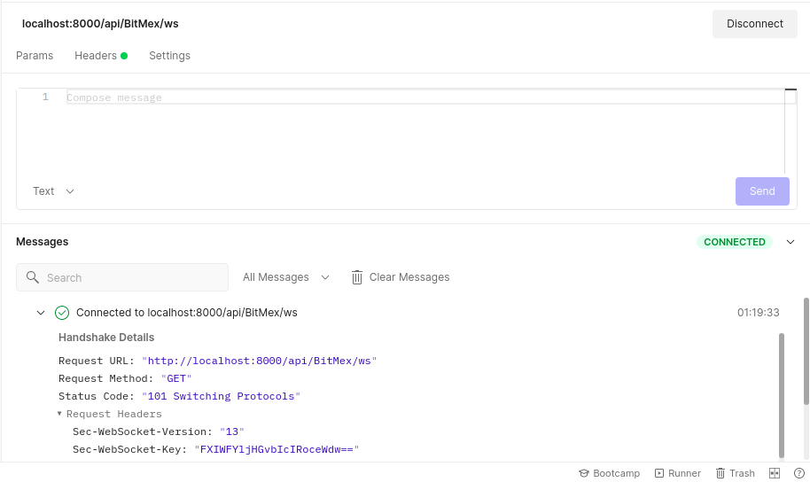
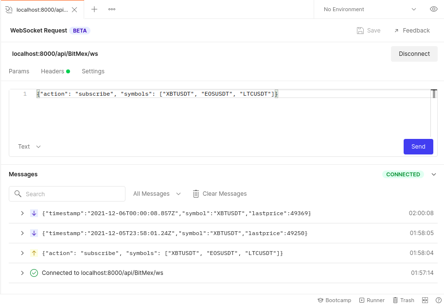
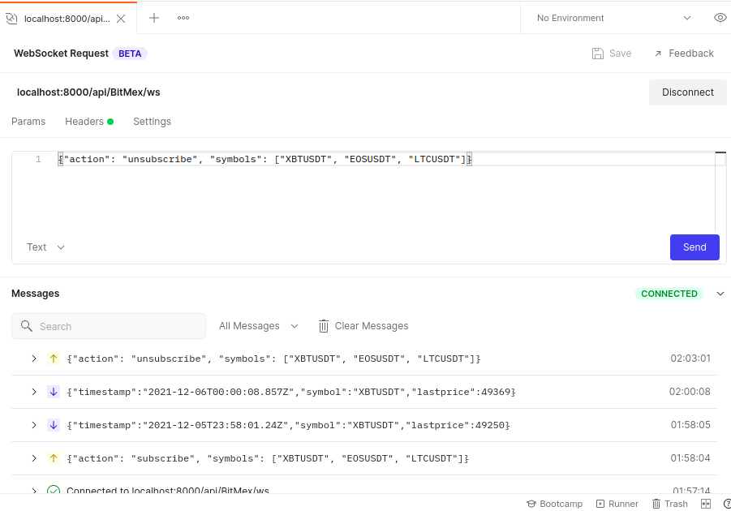

# Websocket Api Gateway BitMEX

This application allows you to subscribe to the [BitMEX](https://www.bitmex.com/). financial exchange, notifications of price changes using a websocket.

### Example subscribe for topics
It is recommended to use [Postman](https://web.postman.co) for testing.

- Example connect websocket 

- Example subscribe on topics

- Example unsubscribe on topics


### Authentication
The "authKeyExpires" operation is used for authentication. The application immediately after connecting sends this command
```
{"op": "authKeyExpires", "args": ["ORqVaoVf1TJrVnKexpWjHfjk", 1638741658, "2333c8d56f1db38cfa6e5e3cd2992b78c96dd6dc07f80e549764a26342fa867c"]}
```

### To Do 
- Test
- Docker
- Сonfiguration

### Useful Links
1) https://github.com/gorilla/websocket/blob/master/examples/echo/client.go
2) https://github.com/adampointer/go-bitmex/tree/6f35eb4e776be519d3327973afea6d0e71e1c512
3) https://testnet.bitmex.com/app/apiKeysUsage#full-sample-calculation
4) https://github.com/BitMEX/sample-market-maker

### Documentation BitMEX
1) https://testnet.bitmex.com/app/wsAPI
2) https://testnet.bitmex.com/api/explorer/

### P.S
Linters used(staticcheck), If my repository helped you then give it a star please :)


